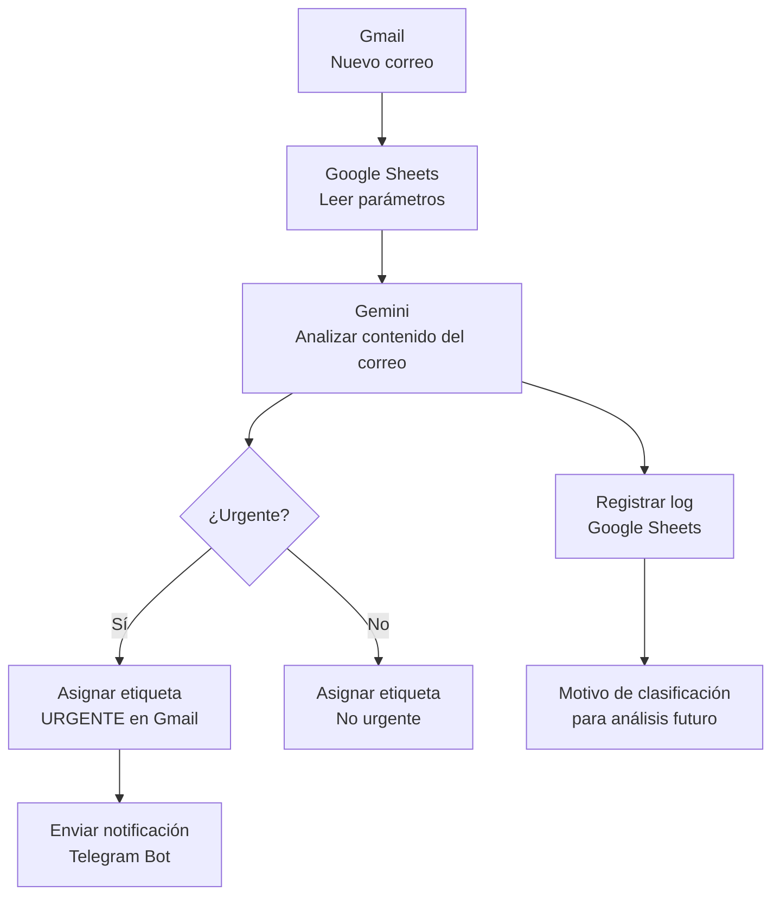
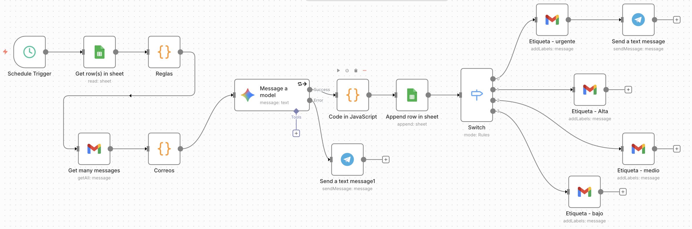

# Automatización Inteligente de Correos con IA, Gmail, Google Sheets y Telegram (n8n)

Este proyecto implementa un sistema automatizado que **lee correos entrantes en Gmail**, analiza su contenido mediante **Gemini (IA)**, determina su **prioridad**, asigna **etiquetas en Gmail** (para que al revisar su bandeja pueda decidir de manera rápida que hacer con los correos revisados), envía **alertas por Telegram** si el correo es urgente y finalmente registra un **log detallado en Google Sheets** para mejorar el modelo con el tiempo.

---

## Objetivo del Proyecto
Construir un **asistente inteligente de correos** capaz de gestionar el flujo diario de emails, clasificarlos de forma automática, priorizar los más importantes y ayudarte a tomar acción rápidamente sin revisar manualmente bandejas extensas.

---

## Utilidad
Este tipo de automatización beneficia a profesionales, equipos y empresas que manejan grandes volúmenes de correos:

- **Gerentes y jefaturas** → filtrar lo realmente importante.
- **Áreas de TI** → priorizar incidentes y requerimientos urgentes.
- **Planeamiento / Procesos** → identificar comunicaciones críticas.
- **Equipos operativos** → enfocarse en tareas de valor.
- **Profesionales independientes** → concentrarse en clientes clave.

**Beneficios**

- Reduce tiempos muertos: 
La IA identifica automáticamente qué correos requieren atención inmediata y cuáles no.
- Mejora la capacidad de respuesta: 
Los correos urgentes generan alertas instantáneas en Telegram, evitando retrasos críticos.
- Estandariza criterios de prioridad: 
Las reglas vienen de Google Sheets, por lo que cualquier área puede ajustar parámetros sin tocar la automatización.
- Aumenta la productividad del equipo: 
Los colaboradores se enfocan en tareas de impacto y no en revisar correos irrelevantes.
- Permite auditoría y mejora continua: 
Cada análisis se registra en Sheets, pudiendo revisar qué razonamiento tuvo la IA y mejorar los parámetros o prompts con evidencia.
- Escalable para cualquier rol: 
Puede adaptarse para un Analista TI, Jefe de Planeamiento, Gerente, Mesa de Ayuda, etc.

---

## Casos Reales de Uso
- Un gerente recibe decenas de correos diarios. La IA detecta cuáles vienen de directores, clientes clave o temas críticos y los notifica a Telegram.
- Un analista de TI recibe incidentes y solicitudes. La automatización prioriza incidentes críticos según palabras clave.
- Un consultor independiente clasifica automáticamente clientes VIP, propuestas comerciales, facturas o comunicaciones rutinarias.
- Un equipo remoto usa Telegram como canal de alerta y no necesita revisar Gmail cada hora.

---

## Arquitectura del Flujo (Mermaid)



---

## Tecnologías Utilizadas
| Componente | Uso |
|-----------|-----|
| **Gmail API** | Lectura de correos y asignación de etiquetas |
| **Google Sheets** | Parámetros de configuración y registro de logs |
| **Gemini AI (via n8n)** | Análisis del contenido del correo |
| **Telegram Bot API** | Notificaciones de urgencia |
| **n8n** | Orquestación del flujo completo |

---

## Parámetros Configurables en Google Sheets
Tu hoja debe tener estas columnas:

### ✓ 1. Lista VIP 
- Correos
- Dominios
- Nombres propios
- Palabras clave

### ✓ 2. Rol 
Ejemplos:
- *“Analista de TI que debe priorizar incidentes críticos.”*
- *“Gerente que debe responder a clientes clave.”*
- *“Jefe de planeamiento que prioriza informes estratégicos.”*

Este rol contextualiza a Gemini para decidir la prioridad.

### ✓ 3. Lista de correos rutinarios
- dominio
- Boletines
- Correos automáticos
- Campañas publicitarias


---

## Flujo General del Proceso

1. La automatización **consulta Google Sheets** y carga:
   - lista VIP
   - lista rutinaria
   - rol configurado
2. **Gmail lee correos.**
   - Filtra los correos de la bandeja de entrada, que no estén leidos y que no tengan la etiqueta IA_Procesado
3. **Un nodo de tipo Code** 
   - Lee los campos del correo y obtiene: remitente, asunto, cuerpo del correo.
   - La información la concatena en un solo texto y se la envía a Gemini
4. **Gemini analiza el correo** y devuelve:
   - prioridad (Urgente / Alta / Media / Baja)
   - Acción
   - motivo de la clasificación
5. **Un nodo de tipo Code** Transforma la respuesta de Gemini a formato JSON. Asimismo, separa el texto en múltiples correos si lo hubiera.
6. **Se asigna una etiqueta en Gmail** según la clasificación.
   - Previamente en gmail se debe haber creado las siguientes etiquetas: 
   IA_Procesado, auto_urgente, auto_alto, auto_medio y auto_bajo 
6. Si es **urgente**, se **envía una alerta por Telegram**.
7. Se registra un **log en Google Sheets**:
   - remitente
   - asunto
   - prioridad clasificada
   - Acción
   - motivo de la IA
   Este registro permitirá identificar el motivo de la clasificación de la prioridad para **mejorar el prompt**

---

## Captura del Flujo (n8n)


---

## PROMPT para analizar los correos

### ROL Eres un Motor de Triaje Masivo de Correos. 
Tu objetivo es analizar una LISTA de correos electrónicos y clasificar CADA UNO individualmente basándote en las reglas de negocio, devolviendo un resultado estructurado. 
### DATOS DE CONTEXTO (Dinámicos de Google Sheets) 
1. **LISTA VIP:** {{ $('Reglas').first().json.listaVips }} 
2. **ROLES Y TEMAS:** {{$('Reglas').first().json.listaRoles}} 
3. **RUTINARIOS:** {{$('Reglas').first().json.listaRutinarios}}   
### INSTRUCCIONES DE PROCESAMIENTO 
Recibirás un array JSON con múltiples correos. Para CADA objeto del array, debes aplicar la siguiente lógica: 
1. **Identificar ID:** Debes conservar el "id" original del correo en tu respuesta para no perder la trazabilidad.
2. **Analizar Prioridad:**    
- **URGENTE:** VIPs, Errores críticos, Plazos "hoy", Palabras de alarma en correos rutinarios pero que tengan contexto de urgencia (Regla Jira). Ante la duda, marca URGENTE.    
- **ALTA:** Importante para el rol, plazos futuros.    
- **MEDIA:** Informativo, seguimiento.    
- **BAJA:** Ruido, notificaciones sin acción.  
### FORMATO DE SALIDA (ESTRICTO) 
Tu respuesta debe ser UNICAMENTE un Array JSON válido (`[...]`). 
No incluyas texto introductorio ni markdown (```json).  
Estructura requerida para cada elemento: [   {     "id": "ID_ORIGINAL_DEL_INPUT", "remitente": "Dirección de correo del remitente", "asunto": "Copia breve del asunto",     "prioridad": "URGENTE | ALTA | MEDIA | BAJA",     "accion": "Notificar | Archivar | Agendar",     "razon": "Explicación muy breve"   },   ... (repetir para todos los correos) ]